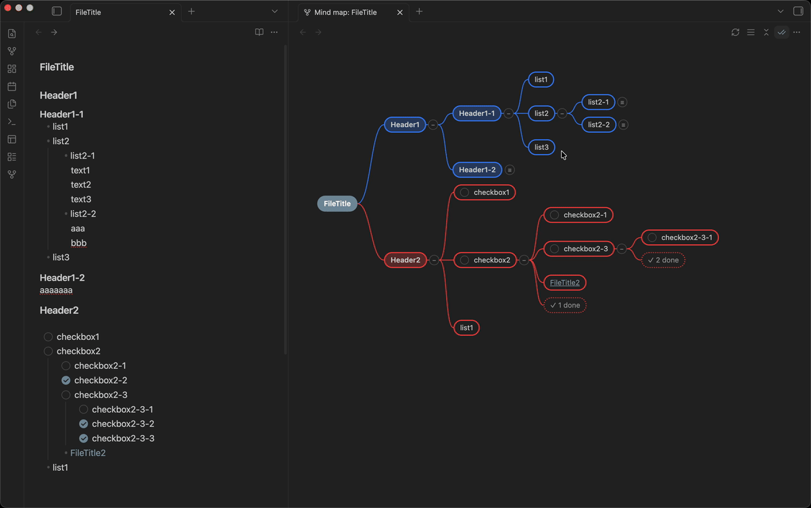

# Mind map editor

Edit your outline as a mind map, synced to Markdown.
No new file format, no markup to add.

## Usage

1. Open a Markdown file.
2. Press Ctrl+P (Cmd+P on macOS) and run `Open mind map for the active file` (or click the ribbon icon).
   Any note's map also opens from `Open mind map` on its right-click menu, in the file explorer or on its tab.
   `Ctrl/Cmd + click` either one for a second map, linked to that note's tab.
3. The map opens in a split and stays in sync while you type.

## Features

- **Automatic mind map** - Headings and bullet lists become nodes, with the note title as the root;
  heading depth and list indentation define the hierarchy.
  Headings stand out by weight and a color-tinted fill; list items are plain.
- **Edit on the map** - Rename, add, delete, drag & drop. Dropping on a node's middle makes it a child;
  dropping near a sibling's top/bottom edge inserts it there. A rename is written as it is typed, and
  `Ctrl/Cmd + Z` takes it back.
- **Working checkboxes** - Clicking toggles `[ ]` ⇄ `[x]` in the file.
- **Collapse branches, in sync with the Markdown pane** - A handle on each node folds its branch (`−` / `+3`),
  and the pane folds with it - both ways, and after a restart. A reading pane takes no fold state, so there
  the map folds its headings by their own handles; its lists stay the reader's. The header buttons and the
  fold commands do the whole map at once.
- **Show a node's own text** - Off by default; the `¶` header button draws the lines under a node that are no
  node of their own inside it, and `≡` on its corner folds them away. Click a line to put the editor's cursor
  on it, double-click to open it there - the map draws this text, the editor writes it. The `¶` button is that
  map's own, so a second map can leave its text alone.
- **Hide completed tasks** - The `✓✓` header button hides checked tasks behind one `✓ n done` node per parent.
  Click it to reveal just that parent (`− hide done` puts them back). Per map, and remembered across sessions.
- **Map and editor follow each other** - Selecting a node brings its note to the front of the Markdown side
  and moves the cursor to its line; moving the cursor selects the node it belongs to - down to the line, where
  a node's text is drawn. Neither side steals the focus.
- **Follow wikilinks** - Clicking a `[[wikilink]]` switches map and editor to the linked note together.
- **Maps side by side, one note each** - A map follows whichever note you open, like Obsidian's own outline.
  `Ctrl/Cmd + click` the ribbon or the right-click item opens a second one as a tab beside it, linked to that
  note's tab so it stays there while the first carries on. The link is Obsidian's own: unlink it from the tab
  menu and it follows the active file again.
- **Branch colors** - Each top-level branch gets a palette color by position and its subtree inherits it.
  Customize the palette in settings, one hex color per line.

## Keyboard shortcuts

Active while the mind map pane is focused.

| Key                     | Action                                                                                                                 |
| ----------------------- | ---------------------------------------------------------------------------------------------------------------------- |
| `↑` / `↓`               | Select previous / next sibling, or walk the node's text line by line                                                   |
| `←` / `→`               | Select parent / first child                                                                                            |
| `Ctrl/Cmd + ←/→`        | Collapse / expand the selected branch (also in the right-click menu)                                                   |
| `Shift + ↑/↓`           | Move the node among its siblings                                                                                       |
| `Enter`                 | Add a sibling (a child on the root)                                                                                    |
| `Tab`                   | Add a child                                                                                                            |
| `F2`                    | Rename the node                                                                                                        |
| `Space`                 | Toggle the selected task's checkbox                                                                                    |
| `Delete` / `Backspace`  | Delete the node and its subtree                                                                                        |
| `Ctrl/Cmd + Z` / `+ ⇧Z` | Undo / redo, through the Markdown pane's history - or one step of the map's own when the note is only open for reading |
| `Esc`                   | End an edit, else clear the selection                                                                                  |

Back/forward use Obsidian's own Navigate back / forward command:
`Ctrl + Alt + ←/→` (`Cmd + Option + ←/→` on macOS).

## Commands

None of these come with a hotkey; bind the ones you want in Settings → Hotkeys.

| Command                                             | What it does                                          |
| --------------------------------------------------- | ----------------------------------------------------- |
| `Open mind map for the active file`                 | Same as the ribbon icon                               |
| `Toggle focus between mind map and Markdown editor` | Jumps between the two panes                           |
| `Collapse all branches` / `Expand all branches`     | The `⌄⌃` header button, one direction at a time       |
| `Fold all node text` / `Unfold all node text`       | The `≡` header button, likewise                       |
| `Show or hide node text on the map`                 | The `¶` header button                                 |
| `Refresh the mind map from the Markdown`            | The `⟳` header button: rebuilds the map from its file |

## Settings

**Settings → Mind map editor**:

- **Hide completed tasks by default** / **Show node text by default** - What a map starts with; each one is
  then switched on its own from its header (`✓✓`, `¶`).
- **Sync collapse state with Markdown folding** (default on) - An editing pane folds both ways; a reading pane
  follows along by its headings. List folding also follows Obsidian's Editor → Fold settings.
- **Split direction** - Side by side / stacked, for any pane the plugin splits open (the first map, or an
  editor for a note that has none). Later maps are tabs beside the first.
- **Branch colors** - Custom palette, one hex color per line.

---

Building, testing and releasing the plugin: [docs/DEVELOPMENT.md](docs/DEVELOPMENT.md).
